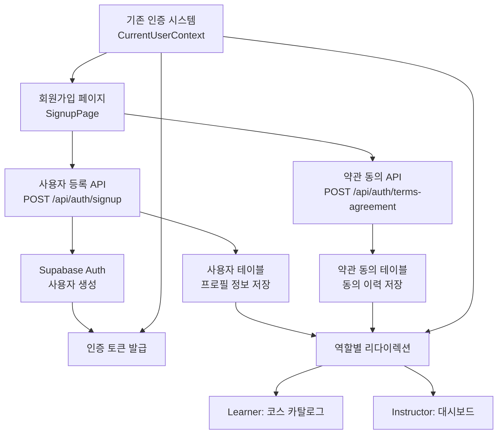

# 역할 선택 & 온보딩 기능 모듈화 설계

## 개요

### 1. 회원가입 폼 개선 모듈
**위치**: `src/app/signup/`
**설명**: 기존 회원가입 페이지를 확장하여 역할 선택, 이름, 휴대폰번호, 약관 동의 기능을 추가

### 2. 사용자 등록 API 모듈
**위치**: `src/features/auth/backend/`
**설명**: 회원가입 시 사용자 정보(역할, 이름, 휴대폰번호)를 데이터베이스에 저장하는 API 엔드포인트

### 3. 약관 동의 관리 모듈
**위치**: `src/features/auth/backend/`
**설명**: 약관 동의 이력을 저장하고 관리하는 API 엔드포인트

### 4. 역할 기반 인증 모듈
**위치**: `src/features/auth/`
**설명**: 사용자 역할에 따른 접근 권한 및 리다이렉션 로직을 관리

### 5. 타입 및 스키마 모듈
**위치**: `src/features/auth/`
**설명**: 회원가입, 사용자 정보, 약관 동의 관련 타입 정의 및 Zod 스키마

## Diagram



## Implementation Plan

### 1. 회원가입 폼 개선 모듈

**구현 계획:**
- 기존 `src/app/signup/page.tsx`를 확장하여 다음 필드 추가:
  - 역할 선택 (Radio 버튼: Learner/Instructor)
  - 이름 입력 필드
  - 휴대폰번호 입력 필드
  - 약관 동의 체크박스
- 폼 검증 로직 강화 (휴대폰번호 형식, 약관 필수 동의)
- 에러 메시지 처리 개선 (Dialog 컴포넌트 사용)

**QA Sheet:**
- [ ] 역할 선택이 제대로 작동하는가?
- [ ] 이름 입력 필드가 올바르게 검증되는가?
- [ ] 휴대폰번호 형식이 한국 표준을 따르는가? (010-0000-0000)
- [ ] 약관 동의 체크박스가 필수인가?
- [ ] 모든 필드가 채워지지 않으면 회원가입 버튼이 비활성화되는가?
- [ ] 입력값 검증 에러 메시지가 명확한가?
- [ ] 성공 시 적절한 페이지로 리다이렉션되는가?

### 2. 사용자 등록 API 모듈

**위치**: `src/features/auth/backend/`
**파일**: `route.ts`, `service.ts`, `schema.ts`, `error.ts`

**구현 계획:**
- `POST /api/auth/signup` 엔드포인트 구현
- 요청 스키마: 이메일, 비밀번호, 역할, 이름, 휴대폰번호
- Supabase Auth 사용자 생성 후 프로필 정보 저장
- 트랜잭션 처리로 데이터 일관성 보장

**Unit Test:**
```typescript
// 사용자 등록 서비스 테스트
describe('registerUser', () => {
  it('should create auth user and profile successfully', async () => {
    // Given
    const userData = {
      email: 'test@example.com',
      password: 'password123!',
      role: 'learner',
      name: '테스트 사용자',
      phoneNumber: '010-1234-5678'
    };

    // When
    const result = await registerUser(userData);

    // Then
    expect(result.ok).toBe(true);
    expect(result.data.user).toBeDefined();
    expect(result.data.profile).toBeDefined();
  });

  it('should handle duplicate email error', async () => {
    // Given
    const duplicateEmailData = {
      email: 'existing@example.com',
      password: 'password123!',
      role: 'instructor',
      name: '기존 사용자',
      phoneNumber: '010-9876-5432'
    };

    // When
    const result = await registerUser(duplicateEmailData);

    // Then
    expect(result.ok).toBe(false);
    expect(result.error.code).toBe('EMAIL_ALREADY_EXISTS');
  });
});
```

### 3. 약관 동의 관리 모듈

**위치**: `src/features/auth/backend/`
**파일**: `route.ts`, `service.ts`

**구현 계획:**
- `POST /api/auth/terms-agreement` 엔드포인트 구현
- 사용자 ID로 약관 동의 이력 저장
- 중복 동의 방지 처리

**Unit Test:**
```typescript
// 약관 동의 서비스 테스트
describe('agreeToTerms', () => {
  it('should create terms agreement record', async () => {
    // Given
    const userId = 'uuid-user-id';

    // When
    const result = await agreeToTerms(userId);

    // Then
    expect(result.ok).toBe(true);
    expect(result.data.agreement).toBeDefined();
  });

  it('should handle duplicate agreement gracefully', async () => {
    // Given
    const existingUserId = 'uuid-existing-user';

    // When
    const result = await agreeToTerms(existingUserId);

    // Then
    expect(result.ok).toBe(true); // 이미 존재해도 성공으로 처리
  });
});
```

### 4. 역할 기반 인증 모듈

**위치**: `src/features/auth/`
**파일**: `hooks/useRoleBasedRedirect.ts`, `utils/role-redirect.ts`

**구현 계획:**
- 회원가입 성공 후 역할에 따른 자동 리다이렉션
- Learner: `/courses` (코스 카탈로그)
- Instructor: `/dashboard` (강사 대시보드)
- 로그인 시에도 역할에 따른 기본 페이지 설정

**Unit Test:**
```typescript
// 역할 기반 리다이렉션 테스트
describe('getRoleBasedRedirectPath', () => {
  it('should return courses page for learner', () => {
    // Given
    const user = { role: 'learner' };

    // When
    const path = getRoleBasedRedirectPath(user);

    // Then
    expect(path).toBe('/courses');
  });

  it('should return dashboard for instructor', () => {
    // Given
    const user = { role: 'instructor' };

    // When
    const path = getRoleBasedRedirectPath(user);

    // Then
    expect(path).toBe('/dashboard');
  });
});
```

### 5. 타입 및 스키마 모듈

**위치**: `src/features/auth/`
**파일**: `types.ts`, `schema.ts`

**구현 계획:**
- 회원가입 요청/응답 타입 정의
- 사용자 프로필 타입 정의
- 약관 동의 타입 정의
- Zod 스키마로 입력 검증

**타입 정의 예시:**
```typescript
export type UserRole = 'learner' | 'instructor';

export type SignupRequest = {
  email: string;
  password: string;
  role: UserRole;
  name: string;
  phoneNumber: string;
  agreeToTerms: boolean;
};

export type UserProfile = {
  id: string;
  email: string;
  role: UserRole;
  name: string;
  phoneNumber?: string;
  createdAt: string;
  updatedAt: string;
};
```

## 개발 우선순위 및 의존성

1. **Phase 1**: 타입 및 스키마 정의 (기반 작업)
2. **Phase 2**: 사용자 등록 API 구현 (핵심 비즈니스 로직)
3. **Phase 3**: 약관 동의 관리 API 구현 (추가 기능)
4. **Phase 4**: 회원가입 폼 개선 (프론트엔드 UI)
5. **Phase 5**: 역할 기반 리다이렉션 구현 (사용자 경험 개선)

## 기존 코드 활용 및 확장

- 현재 `src/features/auth/` 구조를 최대한 활용
- 기존 인증 컨텍스트와 통합
- 현재 로그인/회원가입 페이지의 패턴을 유지하면서 확장
- AGENTS.md의 가이드라인을 엄격히 준수

이 설계는 최소한의 변경으로 최대한의 기능을 구현하는 것을 목표로 하며, 기존 코드베이스의 안정성과 패턴을 유지합니다.
