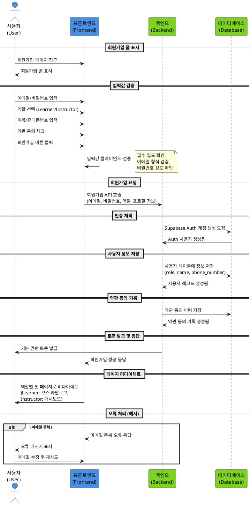

# 역할 선택 & 온보딩 유스케이스 명세서

## Primary Actor
사용자 (회원가입을 원하는 사람)

## Precondition
- 사용자가 아직 회원가입하지 않은 상태
- 인터넷 연결이 가능하고 브라우저가 정상 작동하는 환경

## Trigger
사용자가 회원가입 버튼을 클릭

## Main Scenario
1. 사용자가 회원가입 페이지에 접근
2. 이메일과 비밀번호를 입력
3. Learner 또는 Instructor 역할을 선택
4. 이름과 휴대폰번호를 입력
5. 약관에 동의
6. 회원가입 버튼 클릭
7. 시스템이 입력값을 검증
8. Supabase Auth 계정 생성
9. 사용자 테이블에 역할 및 프로필 정보 저장
10. 약관 동의 이력 저장
11. 기본 권한 토큰 발급
12. 역할에 따른 첫 페이지로 리다이렉트

## Edge Cases
- 이메일 중복: 이미 등록된 이메일인 경우 오류 메시지 표시
- 입력값 누락: 필수 필드 누락 시 오류 메시지 표시
- 비밀번호 약함: 보안 정책에 맞지 않는 비밀번호 입력 시 오류 메시지 표시
- 휴대폰번호 형식 오류: 잘못된 형식의 휴대폰번호 입력 시 오류 메시지 표시
- 약관 미동의: 약관에 동의하지 않으면 회원가입 불가
- 네트워크 오류: 연결 실패 시 재시도 유도

## Business Rules
- 이메일은 중복 불가
- 비밀번호는 최소 8자 이상, 대소문자/숫자/특수문자 포함 필수
- 역할은 Learner 또는 Instructor 중 하나만 선택 가능
- 약관 동의는 필수이며 이력이 저장됨
- 회원가입 완료 시 역할에 따른 접근 권한이 자동 부여됨

## Sequence Diagram

